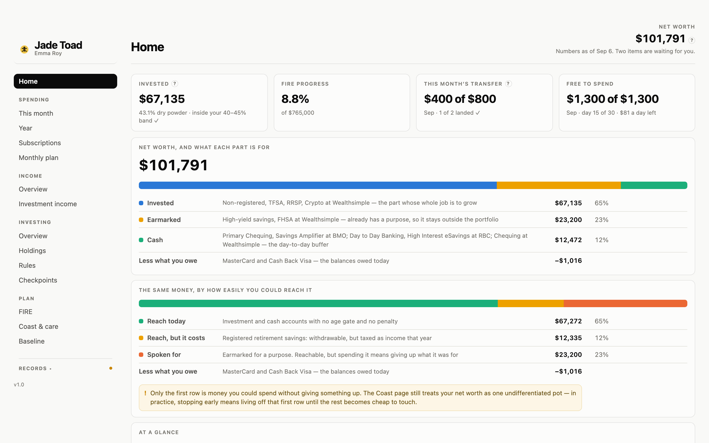
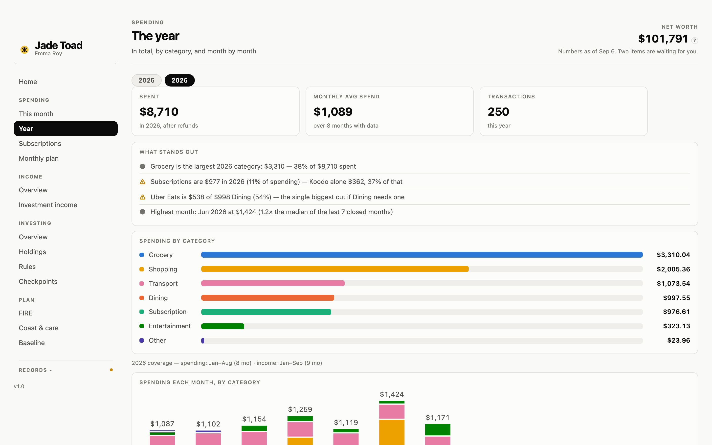
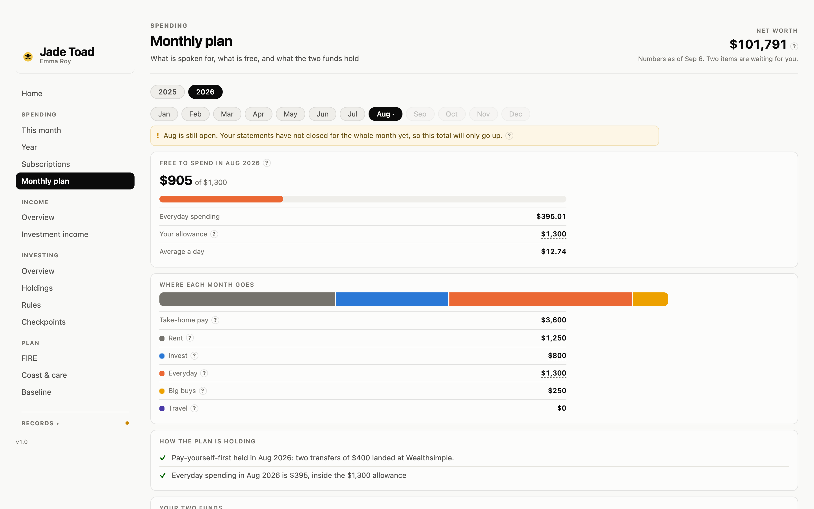
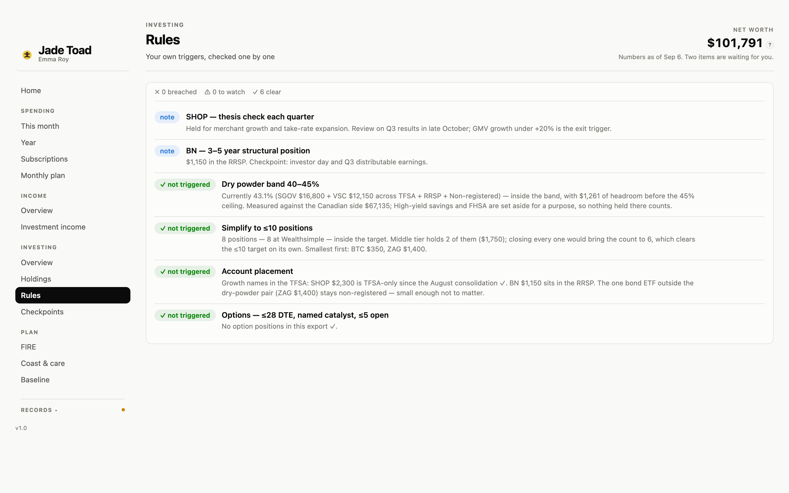
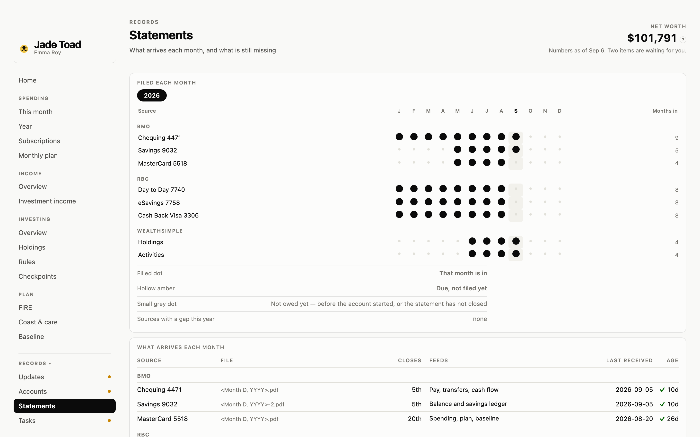
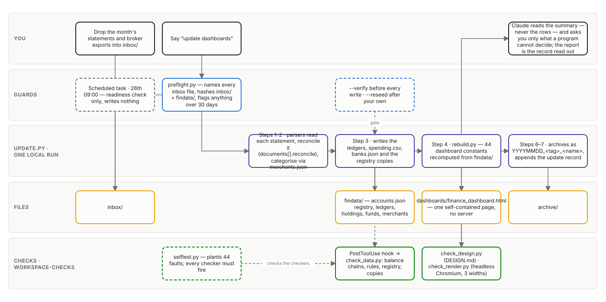

<p align="right"><a href="README.md">English</a> · <b>中文</b></p>

<p align="center">
  
</p>

# Jade Toad · 玉蟾

**你的钱，一页看完，一组检查器保证数字是真的。**

每个月做一件事：把银行对账单和券商导出丢进一个文件夹，说一句「更新仪表盘」。Claude Code
读取它们、核对每份对账单是否对平、给每笔消费归类、重建仪表盘，然后告诉你这个月变了什么。
没有服务器，不登录银行，不用记账 App —— 一个装着 CSV 和 JSON 的文件夹，加一个用浏览器打开的
HTML 页面。对账单和数据都留在这个文件夹里，导入是一个本地脚本。Claude 读到的只是它的摘要 ——
没见过的商户、解析器读不了的对账单、你的回答 —— 这些会像你在 Claude Code 里说的任何话一样送到
Anthropic；解析器读成功的对账单，它从不看。

## 长什么样

| | |
|---|---|
|  | **Home。** 净值按「每一部分是干什么的」和「多容易拿到」各切一次。下面一句话告诉你数字截至哪天、还缺什么。 |
|  | **Spending。** 先看这个月按分类拆开，再看一年按月。没有分类上限 —— 只有一条日常额度，线以下都是 guilt-free。 |
|  | **Monthly plan。** 工资去了哪：先付固定支出，先投资，剩下多少自由花，两个基金里有多少。 |
|  | **Investing。** 你自己定的规则 —— 现金区间、持仓上限、写下的论点 —— 逐条对照实际持仓核对。 |
|  | **Records。** 哪份对账单哪个月到了、每个账户还缺什么、每次更新改了什么、有什么等你确认。 |

## 一分钟试一下

什么都不用装。克隆仓库，用浏览器打开 `dashboards/finance_dashboard.html`（桌面，窗口至少
1120px 宽）。

你看到的是 **Emma Roy** 的一年：31 岁，Ottawa 的项目协调员，一个并不存在的人。所有数字都是
合成的，但每条余额链依然闭合 —— 因为检查器不允许页面在不闭合的情况下被造出来。

## 二十分钟做成你自己的

你需要 [Claude Code](https://claude.com/claude-code)、Python 3.9 或更新、一个在你设备之间同步的
文件夹（iCloud Drive、OneDrive、Dropbox —— 手机拍的对账单，电脑上就能处理），以及上个月的对账单。
就这些；不连银行，不订阅任何服务。

1. **把上个月的文件丢进 `inbox/`**，文件名保持银行默认的样子：每份银行对账单、券商的持仓和活动导出、
   海外资产的截图。
2. **在你的副本里对 Claude Code 说「set this up」。** 它读这些文件，起草你的账户、每月要交的文件和
   月计划，按表格给你看。你改错的地方，再回答文件回答不了的 —— 你的名字、某个账户是干什么的、
   你怎么投资 —— 大约十几个问题。每个问题都答完之前，什么都不会写。
3. **说「更新仪表盘」。** 同一批文件就是你的第一次导入，页面就填满了。
4. **看它问你什么。** 一个没见过的商户、一笔认不出的转账：每一条都在 Records → Updates 等着，
   旁边写着它暂时按什么处理。你说一句，它就归档。

开始之前两件事值得知道：

- `pip3 install --user pypdf` 让解析器直接读你的 PDF。不装的话，Claude 会逐份手读 —— 慢一点，但能用。
- 真实数据不要进任何公开仓库。自带的 `.gitignore` 保护了 `inbox/` 和 `archive/`，但 demo 的
  `findata/` 是被 git 跟踪的；你的一旦是真的，先跑 `git rm -r --cached findata`，再把
  `.gitignore` 里 `findata/` 那一行取消注释。

> **给谁用。** 在加拿大领工资、在五大行之一或之二有几个账户、有一个券商账户、想让自己的计划被盯住的人。
> 它认识的免税账户是 TFSA、RRSP 和 FHSA，金额是加元，退休那部分的算法假设了 CPP 和 OAS。对账单由解析器
> 读，每家银行每种对账单一个：现在有 RBC 和 BMO，加 Wealthsimple 的导出；接下来按顺序是 TD、Scotiabank、
> CIBC，然后 Questrade 和 Interactive Brokers。你的银行还没有解析器之前，那些对账单由 Claude 手读 ——
> 慢，而且意味着它看到了。其余一切 —— 账户、分类、投资规则 —— 都是你在访谈里填的数据，所以别的地方也能用。

## 每个月实际怎么走

1. **导入日**（默认每月 26 日；会有提醒列出哪些到了、哪些还缺）。把这个月的对账单下载进 `inbox/`。
   文件名别改 —— 它就是靠文件名认出每个账户的。
2. **说「更新仪表盘」。** 一个本地脚本把这个月做完：动手之前先把每份文件认出来、查重；每份对账单
   由它的解析器读取，必须和对账单自己的合计对平才允许写入；消费按商户归类；页面重建；原件移进
   `archive/`。Claude 只读脚本的摘要，把程序决定不了的事拿来问你 —— 没见过的商户、解析器读不了的
   对账单 —— 然后给你一份简短的报告：变了什么、注意到什么、替你做了哪些判断、哪些要你拍板。
3. **打开页面。** Records → Statements 是一张打卡表，哪个月缺了哪份文件一眼可见。

Emma 每月要丢八份文件：RBC 三份 PDF、BMO 三份 PDF、Wealthsimple 两份导出。你的是你注册表里写的那些。

## 为什么数字可信

页面上每个数字都是从数据文件夹算出来的，没有一个是手打的。四个检查器守着这条线，第五个检查
前四个：

- **钱对不对得上** —— 每本账的余额链闭合，每份对账单和自己的合计对平，还款永远不算收入，
  注册表和它的来源一致。
- **页面是否守着设计规则** —— 图表高度、行宽、对比度、导航和页面对应、这份 README 和真实页面对应。
- **真的画得出来** —— 无头浏览器在三种宽度打开每一页，找没渲染出来的东西。
<!-- LINT:FAULTS n=44 -->
- **检查器自己还在不在工作** —— selftest 在工作区副本上种下 44 个故障，逐个断言会被抓住。
  它存在是因为有一次检查器 lint 了一个空目录还报了通过。

干净时一声不吭。出了问题就是一条带编号的发现，按出错的种类分组。

<details>
<summary>自己跑一遍</summary>

```bash
python3 .claude/skills/workspace-checks/scripts/check_data.py .
python3 .claude/skills/workspace-checks/scripts/check_design.py dashboards/finance_dashboard.html
python3 .claude/skills/workspace-checks/scripts/check_render.py dashboards/finance_dashboard.html
python3 .claude/skills/workspace-checks/scripts/selftest.py .
```

先跑 `check_data.py`；加 `-v` 列出通过的项。`check_render.py` 需要 Playwright
（`pip3 install --user playwright && python3 -m playwright install chromium`）。
</details>

## 底下是怎么回事

<details>
<summary>文件夹</summary>

```
inbox/        往这里丢新文件，处理完自动移进 archive/
findata/      唯一事实来源，按「谁写它」分三层：
  register/     你的声明 —— 账户、计划、规则、商户
  ledgers/      导入写下的事实 —— 每本账、消费、券商导出
  history/      每次更新留下的记录 —— 更新、决定、归档、快照
dashboards/   造出来的页面（一个自包含的 HTML）
templates/    页面代码，所有数字为空；dashboards/ 由它造出
archive/      处理过的原件，按 <日期>_<来源>_<原名> 归档
docs/         流程图和中文向导
.claude/      三个技能：setup、update-dashboard、workspace-checks
tools/        demo 数据、迁移脚本、同步进工作区
```

文件夹叫 `findata/` 而不是 `data`，是因为 iCloud for Windows 会拒绝同步任何叫 `data` 的文件夹。
这个坑花了一天。
</details>

<details>
<summary>流程图</summary>



*可编辑的源文件：[`docs/pipeline.drawio`](docs/pipeline.drawio)，由 `docs/pipeline.py` 生成。*
</details>

<details>
<summary>纲领文件</summary>

| 文件 | 管什么 |
|---|---|
| `CLAUDE.md` | Claude 在这里怎么工作：信息模型、导入、检查器 |
| `FINANCE.md` | 钱的逻辑：FIRE 目标、pay-yourself-first、什么算收入 |
| `DESIGN.md` | 页面长什么样、怎么说话：配色、导航、文案 |
| `OWNER.md` | **你的** —— 你的银行、你踩过的坑、你的决定；另外三份不提任何人 |

它们是规则不是笔记：每一行都是出过问题之后写下的，每次改动前都会被读。口头约定必须落回其中
一份，否则下次会话不作数。

**更详细的中文介绍见 [`docs/zh/guide.md`](docs/zh/guide.md)。**
</details>

<details>
<summary>工具与你的工作区</summary>

这个仓库是工具。你的工作区 —— 那个同步的文件夹，装着你的 `findata/`、`inbox/`、`OWNER.md`
—— 是它的一个实例。`tools/sync.py <workspace>` 把技能、模板和纲领文件复制进去，不碰任何属于你
的东西；工具的数据形状比你的文件夹新时，`tools/migrate.py <workspace>` 会一步一步把文件夹迁上来。

<!-- LINT:NAV main=19/5 minwidth=1120 -->
页面共 19 页、5 个侧栏分组 ——
Home · Spending · Income · Investing · Plan · Records
—— 仅桌面，窗口至少 1120px 宽。
</details>

## 许可

MIT —— 见 [`LICENSE`](LICENSE)。
