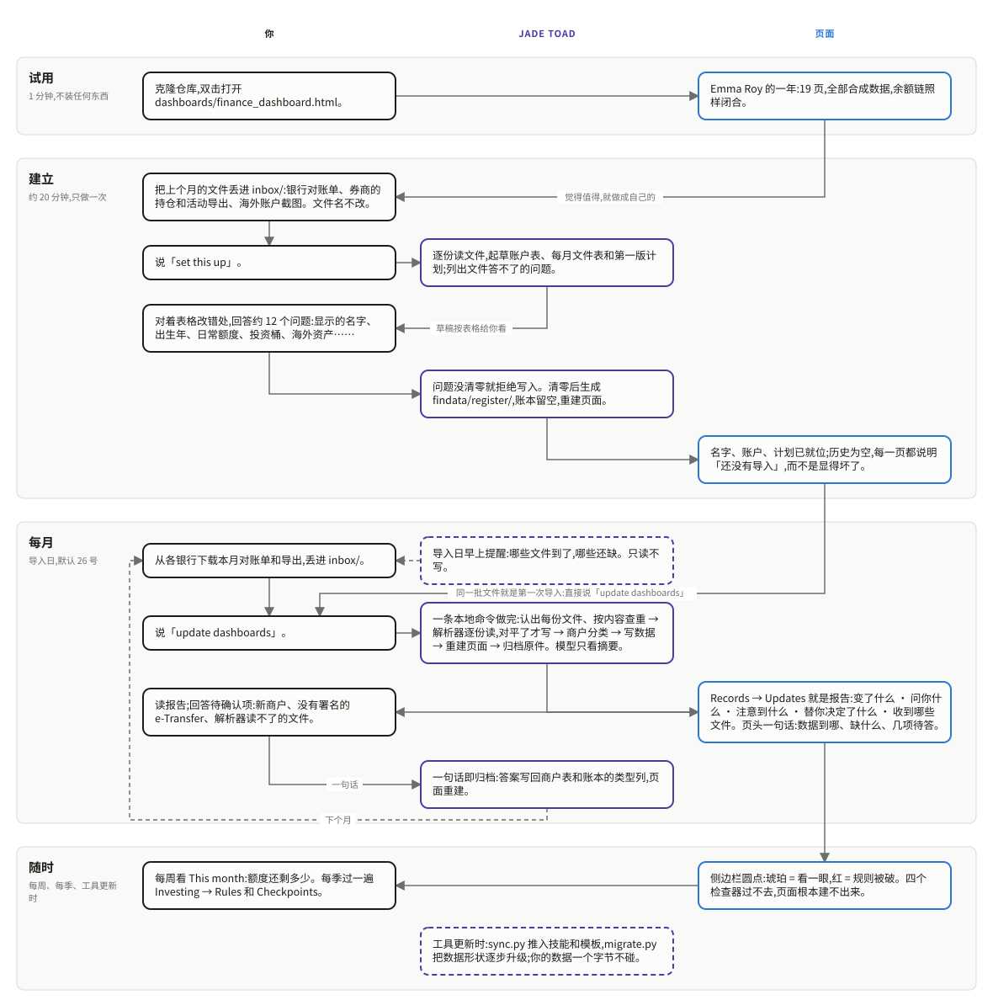

# 这是什么

一个跑在 Claude Code 里的个人财务工作区。

每个月做一件事:把银行对账单和券商导出下载下来,丢进 `inbox/`,然后对 Claude 说一句
「更新仪表盘」。剩下的——解析 PDF、和账单总额对平、给商户分类、更新数据、重建仪表盘、
把原件归档、汇报这个月哪些数变了——都由它完成。

没有服务器,没有数据库,不连任何银行 API,也不用记账 App。数据是一堆 CSV 和 JSON,仪表盘是
一个自包含的 HTML 文件,双击就能在浏览器里打开。**对账单和数据只存在你自己的文件夹里,导入是一个
本地脚本;Claude 只读脚本的摘要(没见过的商户、解析器读不了的对账单、你的回答),这些会送到
Anthropic,解析器读成功的对账单它从不看。**

> 这个仓库里的数字**全是合成的**,属于一个并不存在的人:Ottawa 的项目协调员
> Emma Roy(31 岁,单身租房)。余额链闭合、对账单对得上、基金认领不超过账户余额——
> 因为检查器不允许它们不成立。但背后没有任何一个真实账户。

---

## 长什么样

### 净值,两种拆法

### 一年的支出,按分类、按月

### guilt-free 的每月计划

### 哪个月交了哪份文件

### 你自己定的投资规则,逐条核对

---

## 它和记账 App 有什么不一样

**规则是写下来的,而且每次都被逐条核对。**

工作区里有三份纲领文件——`CLAUDE.md`(怎么做事)、`FINANCE.md`(钱的逻辑)、`DESIGN.md`
(长什么样)。它们不是笔记,是规范:Claude 每次动手前都会读,口头说过的话必须落回其中一份,
否则下次会话不作数。

在这之上有四个检查器。它们不是"提个醒",是**过不去就不算做完**:

- 余额链不闭合、对账单合计对不上、认领超过账户余额 —— 报错
- 页面上的数字和数据文件对不上 —— 报错
- 图表被固定高度卡住、灰字对比度不够、导航和页面对不上 —— 报错
- 无头浏览器实际打开每一页:有页面画不出来、有横向滚动、页面上出现 `undefined` —— 报错

还有第五个,专门检查前面四个:它在工作区副本上**故意种下几十个具体故障**,逐个断言对应的检查器
会响。起因是有一次检查器指错了目录、报了三个"文件缺失"、然后**退出码 0 说通过**——
一个已经不检查了却还在报平安的检查器,比没有检查器更坏。

---

## 从试用到每个月,整条路

*可编辑的源文件:[`product_flow.drawio`](product_flow.drawio),由 `product_flow.py` 生成。
这张图是用的人看到的顺序;`../pipeline.svg` 那张画的是数据怎么流过脚本和检查器。*

---

## 每个月实际怎么走

1. 每月 26 日(可改),把对账单和券商导出丢进 `inbox/`。**文件名保持银行默认的样子**,
   解析靠它认账户。
2. 说「更新仪表盘」。一条本地命令(`update.py`)把这个月做完:先把 `inbox/` 里每份文件认出来是
   哪个账户、找出逐字节重复件;**认不出来的文件会停下来问你**。然后逐份解析、对账,对平了才写;
   消费按商户归类;写数据;重建仪表盘;原件归档;把这次更新的记录追加进去。
3. Claude 只读它的摘要:新商户、认不出的转账、解析器读不了的文件、没法归类的行。这些才拿来问你,
   不会替你猜。
4. 汇报就是那条记录读出来:哪些数变了、注意到什么、替你做了哪些判断、哪些要你拍板。

---

## 想搭一套自己的

先把上个月的对账单、券商导出丢进 `inbox/`,再说「set this up」。它从这些文件里起草你的账户、
每月要交的文件和月计划(`accounts.json` 是那张地图:一个账户一行,每月要交的一份文件一行),
只问文件回答不了的,答完才写出 `findata/`。然后说「更新仪表盘」,同一批文件就是第一次导入。

[`README.zh.md`](../../README.zh.md) 的「二十分钟做成你自己的」一节写得更细。**具体数字、金额、规则的细节都在
`FINANCE.md` 里,这份向导不重复它们**——重复一遍就会有两份规则,而两份规则里总有一份是旧的。

⚠ 数据文件夹**不要叫 `data`**:iCloud for Windows 会把叫 `data` 的文件夹整个排除同步。
